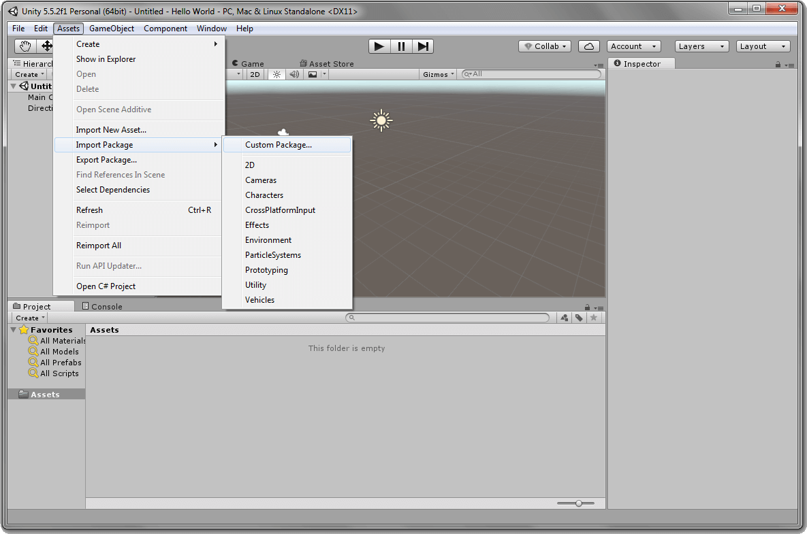
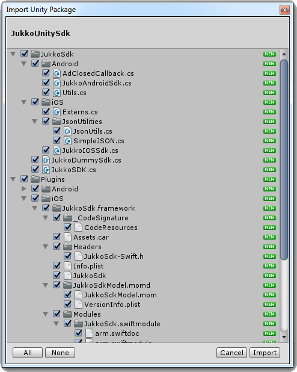

# Jukko Unity SDK documentation


Welcome to the Jukko developer SDK documentation. Follow our step-by-step instructions to
integrate Jukko and start monetizing while converting your app into a catalyst for social
impact today!

If you have any questions during the integration process, you can reach us at [devs@jukko.com](mailto:devs@jukko.com)
and we'll get back to you ASAP. Thanks for joining our movement to create a better world and a better way of doing business.

## Integration

1. **Download:** [Jukko Unity SDK](https://sdk.jukko.com/unity/JukkoUnitySDK-1.0.5.unitypackage).

2. Open your project in the Unity Editor. Open **Assets - Import Package - Custom Package...** and select `JukkoUnitySDK.unitypackage` file:

    

3. Check that all files and directories are selected and click **Import**:

    

    This operation should create 2 subdirectories inside `Assets` folder:

    * **JukkoSDK** - Jukko script files

    * **Plugins** - rest of Jukko (native integration)

4. Use the Jukko framework in your project. Take a look at the `Assets/JukkoSDK/Jukko.cs` files to see available classes and interfaces and a list of the supported methods.

## Usage

### Initialization

Initialization has to be done before Jukko SDK can be customized and launched. The method will
need an API key. The API key can be generated in the dashboard after registration.
You can register on the [Jukko dashboard](https://dashboard.jukko.com).

```csharp
JukkoSdk.Instance.Init ("YOUR_API_KEY");
```

In case You are building application for both Android and iOS, You should get separate keys for each platform.
Initialization will look like following:

```csharp
#if UNITY_ANDROID
JukkoSdk.Instance.Init ("ANDROID_API_KEY");
#elif UNITY_IOS
JukkoSdk.Instance.Init ("IOS_API_KEY");
#endif
```

### Showing an ad

You can show an ad by calling `ShowAd ()` method of Jukko SDK:

```csharp
JukkoSdk.Instance.ShowAd ((ShowAdResult result) => {
    //handle ShowAdResult here
});
```

When ad UI is closed, `ShowAdResult` delegate will be called. It will contain an object with the following information:

1. `Reason`: reason why the ad was closed. Possible values are:
    * `ClosedByUser`: Ad view was closed by user.
    * `Timeout`: Ad view  was closed due to server did not response within timeout.
    * `NetworkConnectivity`: Ad view was closed due to network connectivity problems.
    * `FrequencyCapping`: Ads frequency capping is enabled and time period didn't pass since the last `ShowAd()` call.
    * `Error`: Ad view was closed due to unspecified error. Additional details will be provided in `Message`.
2. `Message`: string containing additional information why activity was closed.
3. `Events`: list of events that happened on ad view lifecycle. May be empty. Each event contains:
    * `timestamp` of the event in current device timezone.
    * `adEvent` type of event. Possible values:
        * `Launch`: Ad view was opened.
        * `Close`: Ad view was closed.
        * `AdShown`: Ad was shown to user.
        * `AdUrlOpened`: user clicked on ad link that was opened in external browser.

### Frequency capping

Jukko SDK allows developer to set frequency capping for ads. It counts time since the last time when an ad was closed
and ignores `ShowAd ()` calls until frequency capping period ends. Frequency capping can be changed using:

```csharp
JukkoSdk.Instance.AdsFrequency = timeInSeconds;
```

### Console logging

By default, Jukko SDK logs only important messages, like unrecoverable errors.

You can enable debug logging to receive more logs with lifecycle details by calling:

```csharp
JukkoSdk.Instance.DebugMode = true;
```

SDK will use native log messaging. Log messages will contain `Jukko SDK` tag.

## Android specific information

### Google Play Services

If user has Google Play services on their devices, SDK will automatically use user's
Advertising ID (GAID) and Limit Ad Tracking setting.

For more information about Google Advertising ID visit [this link](https://play.google.com/about/monetization-ads/ads/ad-id/).

### Requirements

Your application should also have `compileSdkVersion` set to `25` or higher. Jukko SDK supports devices starting with Android 4.0 (API level 14). However, due to some older WebView version restrictions, ad UI won't be shown for Android prior to API level 19 and you will only be exposed to some some for the console messages.

## iOS specific information

### Requirements

Jukko SDK support devices starting with iOS 10.0.

### iOS project configuration

1. In Unity go to **File > Build Settings** and choose iOS from the list. Click `Build`. This will generate an iOS project that you need to open with Xcode. More information about this can be found in the Unity documentation.

2. In Xcode go to Project **Settings > General > Linked Frameworks And Libraries** and remove any existing Jukko framework.

3. In the Xcode file explorer, expand the files on the left to **Frameworks > Plugins > iOS**. Drag the JukkoFramework.framework into **Project Settings > General > Embedded Binaries** section. This will add it to **Linked Frameworks And Libraries** section as well (this is what we want).

    

4. Under the Build Settings find `Always Embed Swift Standard Libraries` (Xcode 8) and set it to Yes.

    

5. Ensure that project's Deployment Target version is equal or above 10.0.

6. Build and run the project on your device.